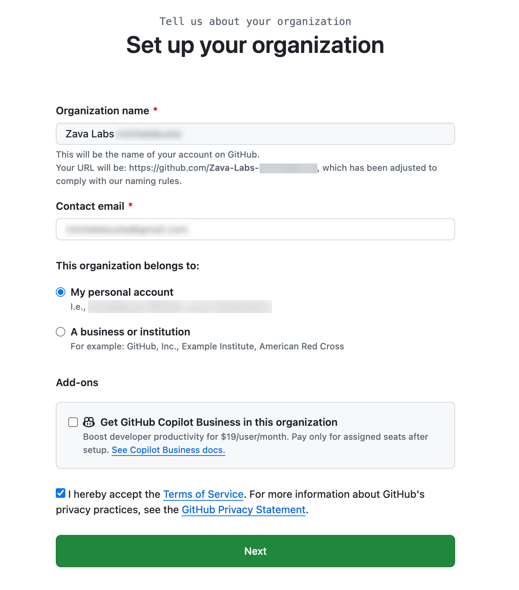
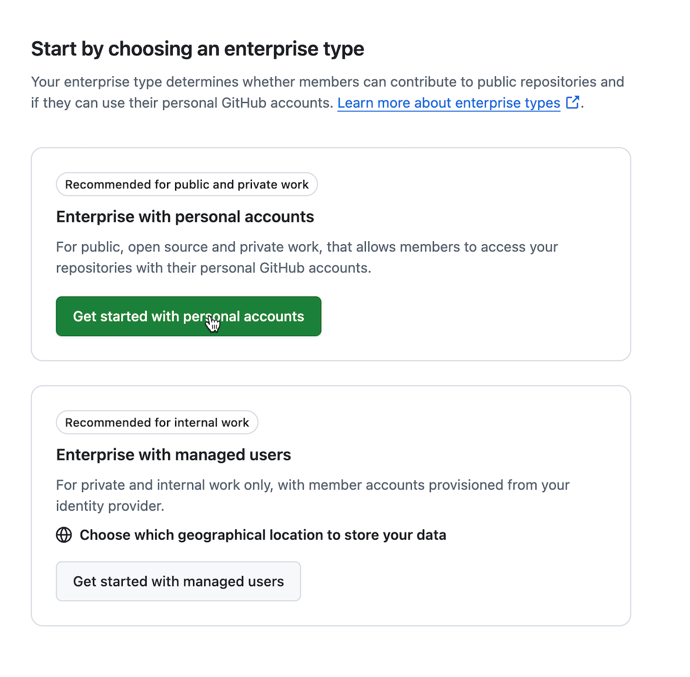
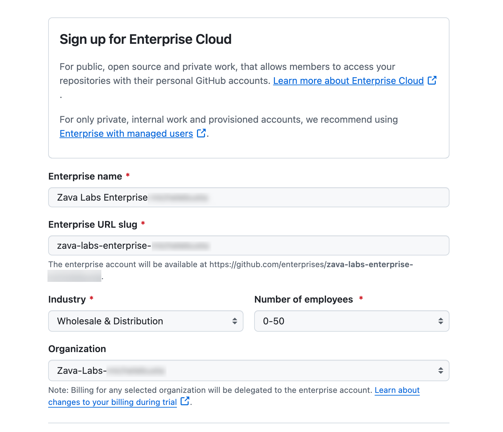

# Prerequisites (Walkthrough)

This page walks you through setting up everything you need before starting the labs.

## Quick checklist

You’re ready when you can check all of these:

- [ ] I have an **external tenant** and an **Azure subscription** set up (per the request process)
- [ ] I have activated my **Azure Visual Studio subscription** and linked it to **GitHub Enterprise**
- [ ] My **GitHub account** is linked to (or can authenticate with) my **Microsoft account**
- [ ] I have an **Azure subscription** and can create resources (at least **Contributor** access)
- [ ] I have **GitHub Enterprise trial** enabled for the lab org (or I can request it)
- [ ] I have verified (and if needed enabled) **GitHub Advanced Security** features for the lab org/repo
- [ ] I have **GitHub Copilot** enabled and the **VS Code extension** installed
- [ ] I have **GitHub Copilot Chat** enabled and the **VS Code extension** installed
- [ ] I have **VS Code**, **Git**, and **Docker** installed locally
- [ ] I have **Node.js** installed (18+, recommended 20 LTS)
- [ ] I have `uv` installed (and can provision **Python 3.11+**)

---

## 1) External tenant + Azure subscription (request)

For this lab, you should use an **external tenant** and an **Azure subscription** created via the official request process.

### Follow the request instructions

- Request your Azure subscription here (follow the steps in the page):
	- https://microsoft.sharepoint.com/teams/Security-EndpointProtection/SitePages/Request-your-Azure-Subscription.aspx?web=1

This SharePoint page already includes screenshots, so they are not duplicated here.

### Verify

- You can sign in to https://portal.azure.com with the account used in the request.
- Under **Subscriptions**, you can see the newly created/assigned subscription.
- You can create a **Resource group** in that subscription.

---

## 2) GitHub account linked to a Microsoft account

This lab expects you to authenticate and access GitHub resources using an identity linked to Microsoft.

### Setup steps (high level)

1. Ensure you can sign in to GitHub at https://github.com using your intended account.
2. Confirm the email on your GitHub account matches (or can be associated with) your Microsoft identity.
3. If your organization uses Microsoft Entra ID SSO:
	- Join the GitHub organization when invited.
	- Complete SSO authorization when prompted.

### Verify

- You can access the lab’s GitHub organization and repositories.
- If SSO is required, you can successfully authorize SSO for the org.

> Placeholder: Add your org’s exact “linking” or SSO instructions (the flow differs by org policy).

---

## 3) Azure subscription

You need an Azure subscription you can deploy resources into.

### Setup steps

1. Sign in to the Azure portal: https://portal.azure.com
2. Confirm you have a subscription available under **Subscriptions**.
3. Confirm your role assignments:
	- You should have at least **Contributor** on the subscription (or on a target resource group).
	- If the lab provisions identity/RBAC, you may need **User Access Administrator** (lab-specific).
4. (Recommended) Install the Azure CLI for local verification: https://learn.microsoft.com/cli/azure/install-azure-cli
5. (Recommended) Sign in via CLI:
	- Run `az login`
	- Run `az account show` and confirm the subscription.

### Verify

- In the Azure portal, you can create a new **Resource group**.
- If using CLI, `az account show` returns the expected subscription.

> Placeholder: Add the exact subscription name/ID to use for the lab and any policy constraints (region restrictions, naming rules, etc.).

---

## 4) (FTE) Activate Visual Studio subscription + link GitHub Enterprise

Complete this after your Azure subscription is set up.

### Activate your Azure Visual Studio FTE subscription

- Follow the instructions here:
	- https://microsoft.sharepoint.com/teams/AELBootCamp/SitePages/Activating-Your-Azure-Visual-Studio-FTE-Subscription.aspx?web=1

### Link your Visual Studio subscription benefit to GitHub Enterprise

- Follow the Microsoft Learn steps here:
	- https://learn.microsoft.com/en-us/visualstudio/subscriptions/access-github

### Verify

- Your Visual Studio subscription is active.
- GitHub Enterprise access is available/assigned per the Microsoft Learn instructions.

---

## 5) GitHub Enterprise trial (30-day)

Before you can use GitHub Advanced Security features in the lab, your GitHub organization must be tied to **GitHub Enterprise**.

### Setup steps

1. **Sign in to GitHub** using the account you will use for the lab.
2. **Select or create a GitHub organization** for the lab.
	- You must be an **organization owner** (or work with someone who is).
    - To create a GitHub organization, execute the following steps:
        1. From your GitHub account select Manage Organizations.
        2. If you do not see an organization you’d like to associate with a GitHub Enterprise account, select New organization.
        3. Choose the Free plan for the organization plan. Select Create a free organization.
        4. Fill out the form. Consider using the name GitHub Lab <your-github-account-name> to ensure it is unique. Click Next.
        
        5. If you don’t plan to add other members, select Complete setup.
3. **Start a GitHub Enterprise 30-day trial** and associate it with the organization:
	- Sign up for a GitHub Enterprise account
        1. Start here: https://github.com/account/enterprises/new
	    2. Trial info (what’s included/required): https://docs.github.com/en/enterprise-cloud@latest/enterprise-onboarding/getting-started-with-your-enterprise/setting-up-a-trial-of-github-enterprise
        
        3. If you are not working in a corporate GitHub account, choose “Get started with personal accounts”.
    - Create your enterprise
        1. Enter the name of your enterprise and choose the GitHub organization to connect to. Consider naming the enterprise GitHub Lab Enterprise <your-github-account-name> to ensure uniqueness.
        2. Fill out the remaining details on the form and select “Create enterprise”.
        

> Note: GitHub will ask for billing information to start the 30-day trial. The lab cleanup process should include removing/disabling trial resources when you’re done.

### Verify

- Your organization shows it is connected to a GitHub Enterprise account (trial active).
- GitHub **Secret Protection** and **Code Security** features are available in your org/repo settings (these are included in the GitHub Enterprise Cloud trial, but may still need to be enabled).

---

## 6) GitHub Advanced Security (GHAS) features enabled

GitHub Advanced Security features are included in the GitHub Enterprise Cloud trial (as **GitHub Secret Protection** and **GitHub Code Security**), but they still need to be enabled at the organization and/or repository level.

### Setup steps (high level)

1. In GitHub, open your **organization**, then go to **Settings**.
2. In the left sidebar, open the org-level security settings (commonly **Security & analysis**).
3. Enable (or confirm enabled) the security features required for the lab:
	- **Dependency graph** (dependency review relies on this)
	- **Dependabot alerts** (recommended)
	- **Dependabot security updates** (recommended)
	- **Code scanning** (GitHub Code Security)
	- **Secret scanning** (GitHub Secret Protection)
	- (Recommended) **Push protection** (blocks commits that contain secrets)
4. In each **repository** used in the lab, confirm the repo-level toggles are enabled:
	- Repository **Settings** → **Security** → **Advanced Security** → enable **Secret Protection**
	- Repository **Settings** → **Security** → **Advanced Security** → under **Code Security**, set up **CodeQL analysis** using **Default** setup

If you don’t see these settings or they’re locked:
	- Confirm you are an **organization owner** (or have the required security admin role).
	- Confirm the org is attached to the **Enterprise trial** created in step 5.
	- Check whether an enterprise policy is enforcing settings.

### Verify

- In a lab repository, you can open the **Security** tab and see areas for **Code scanning**, **Secret scanning**, and **Dependabot**.
- In the repository **Settings**, you can find the relevant security toggles (often under **Code security and analysis**).

---

## 7) GitHub Copilot (VS Code extension)

You need a Copilot subscription assigned to your GitHub user, and the VS Code extension installed.

### Setup steps

1. Confirm Copilot is enabled for your GitHub account:
	- Open your GitHub settings and look for **Copilot** (availability depends on your plan/org).
2. Sign in to GitHub from VS Code:
	- In VS Code, run the command **“GitHub: Sign in”** (Command Palette).
3. Confirm Copilot is active:
	- Open a code file and type a few characters; you should see inline suggestions.

### Verify

- In VS Code, Copilot suggestions appear (or Copilot status shows “Ready”).

---

## 8) GitHub Copilot Chat (VS Code extension)

Copilot Chat requires the chat-capable extension and that your Copilot entitlement includes chat.

### Setup steps

1. Install the VS Code extension:
	- Install **GitHub Copilot Chat** from the VS Code Marketplace.
2. Make sure you’re signed in to GitHub in VS Code (same account as Copilot).
3. Open the Copilot Chat panel and send a test prompt.

### Verify

- Copilot Chat responds without entitlement/auth errors.

---

## 9) Local tooling

These labs involve building/running code locally.

### Setup steps

1. Install **VS Code** (latest stable): https://code.visualstudio.com/
2. Install **Git**: https://git-scm.com/downloads
3. Install **Docker** (Desktop on Windows/macOS, Engine on Linux): https://docs.docker.com/get-docker/
4. Install **Node.js** for the frontend:
	- Required: **Node.js 18+**
	- Recommended: **Node.js 20 LTS**
	- Install from: https://nodejs.org/
5. Install **uv** for Python environments and dependencies:
	- Install instructions: https://docs.astral.sh/uv/getting-started/installation/
6. Provision **Python 3.11+** using uv:
	- Example: `uv python install 3.11`
7. Create/sync the backend environment:
	- From the repo root: `cd backend && uv sync`

### Verify

- VS Code opens and reports a version: `code --version`
- Git is available: `git --version`
- Docker is available: `docker --version`
- Node and npm are available: `node --version` and `npm --version`
- uv is available: `uv --version`
- uv-managed Python meets the minimum: `uv run python --version`
- Backend deps resolve locally: `cd backend && uv sync`
